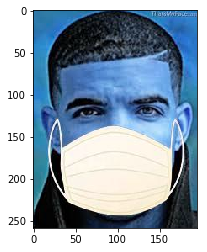

# 口罩数据集处理与介绍

## 解压数据集
把数据集解压到work文件夹下


```python
!unzip -oq /home/aistudio/data/data115986/有病毒时应不应该带口罩.zip -d work/
```

## tree命令查看目录结构


```python
!tree work -d
```

    work
    ├── maskdata
    │   └── maskdata
    │       ├── test
    │       │   ├── with_mask
    │       │   └── without_mask
    │       └── train
    │           ├── with_mask
    │           └── without_mask
    └── masks2.0
        └── masks
            ├── test
            │   ├── 0
            │   └── 1
            └── train
                ├── 0
                └── 1
    
    16 directories


## 样本的可视化展示


```python
import cv2
import matplotlib.pyplot as plt
%matplotlib inline

plt.imshow(cv2.imread("work/maskdata/maskdata/train/with_mask/153-with-mask.jpg"))
```


    <matplotlib.image.AxesImage at 0x7f6bc2058d90>





# 图像数据集


## 计算该数据集的均值和方差


```python
import glob
import numpy as np

def get_mean_std(image_path_list):
    print('Total images:', len(image_path_list))
    max_val, min_val = np.zeros(3), np.ones(3) * 255
    mean, std = np.zeros(3), np.zeros(3)
    for image_path in image_path_list:
        image = cv2.imread(image_path)
        for c in range(3):
            mean[c] += image[:, :, c].mean()
            std[c] += image[:, :, c].std()
            max_val[c] = max(max_val[c], image[:, :, c].max())
            min_val[c] = min(min_val[c], image[:, :, c].min())

    mean /= len(image_path_list)
    std /= len(image_path_list)

    mean /= max_val - min_val
    std /= max_val - min_val

    return mean, std

mean, std = get_mean_std(glob.glob('work/maskdata/maskdata/train/with_mask/*.jpg'))
print('mean:', mean)
print('std:', std)
```

    Total images: 341
    mean: [0.53798353 0.55650533 0.6029105 ]
    std: [0.30616696 0.30058538 0.2889546 ]


# 数据集类的定义（继承paddle.io.Dataset的类）


```python
import paddle
import numpy as np
import paddle.vision.transforms as T

class MyImageNetDataset(paddle.io.Dataset):
    def __init__(self,
                 num_samples,
                 num_classes):
        super(MyImageNetDataset, self).__init__()

        self.num_samples = num_samples
        self.num_classes = num_classes
        self.transform = T.Compose([
            T.Resize(size=(224, 224)),
            T.ToTensor(),
            T.Normalize(mean=127.5, std=127.5)])

    def __getitem__(self, index):
        image = np.random.randint(low=0, high=256, size=(512, 512, 3))
        label = np.random.randint(low=0, high=self.num_classes, size=(1,))

        image = image.astype('float32')
        label = label.astype('int64')

        image = self.transform(image)

        return image, label

    def __len__(self):
        return self.num_samples
```

# 数据集类的测试（调用定义好的数据集类，参考章节[1.2]的文档示例）


```python
train_dataset = MyImageNetDataset(num_samples=1200, num_classes=1000)
print(len(train_dataset))

image, label = train_dataset[0]
print(image.shape, label.shape)

for image, label in train_dataset:
    print(image.shape, label.shape)
    break
```

    1200
    [3, 224, 224] (1,)
    [3, 224, 224] (1,)


```python
train_dataloader = paddle.io.DataLoader(
    train_dataset,
    batch_size=128,
    shuffle=True,
    drop_last=False)

for step, data in enumerate(train_dataloader):
    image, label = data
    print(step, image.shape, label.shape)
```

    0 [128, 3, 224, 224] [128, 1]
    1 [128, 3, 224, 224] [128, 1]
    2 [128, 3, 224, 224] [128, 1]
    3 [128, 3, 224, 224] [128, 1]
    4 [128, 3, 224, 224] [128, 1]
    5 [128, 3, 224, 224] [128, 1]
    6 [128, 3, 224, 224] [128, 1]
    7 [128, 3, 224, 224] [128, 1]
    8 [128, 3, 224, 224] [128, 1]
    9 [48, 3, 224, 224] [48, 1]

